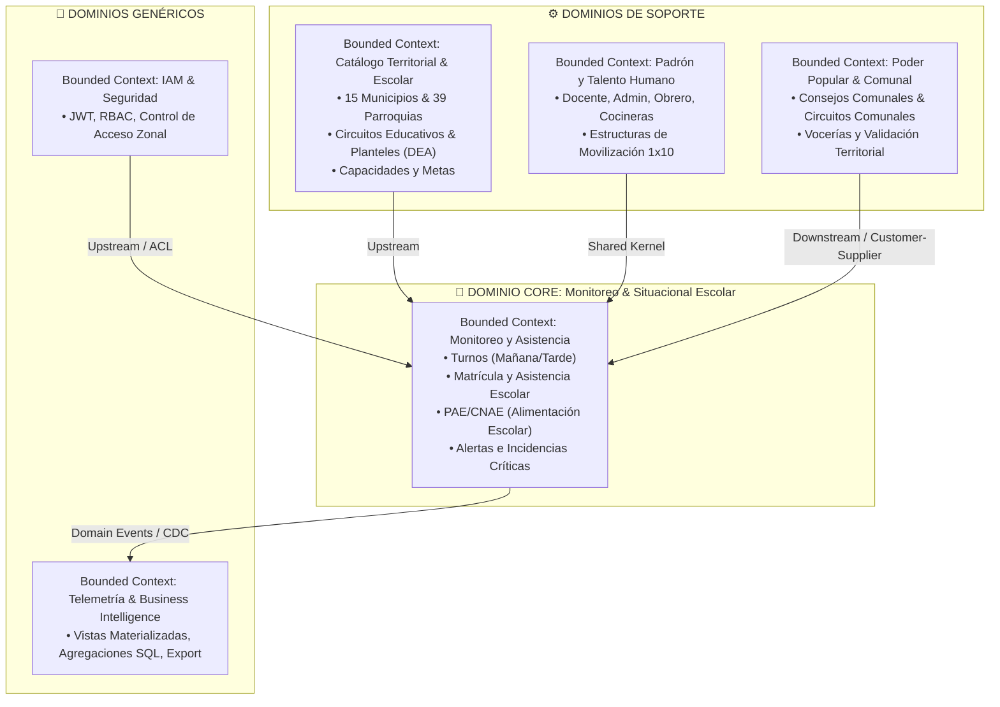
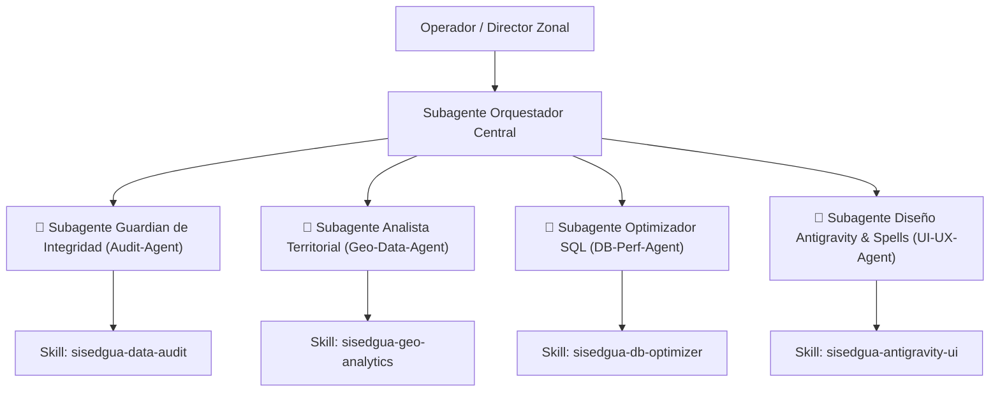
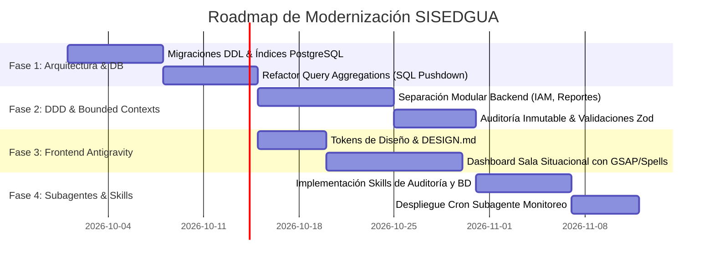

# 🚀 PLAN MAESTRO DE MODERNIZACIÓN ARQUITECTURAL — SISEDGUA
**Zona Educativa del Estado Guárico | Sistema Integral de Seguimiento Educativo**  
**Versión:** 2.0.0-PROD-PLAN | **Fecha:** 2026-09-27 | **Estado:** Propuesta de Arquitectura

---

## Executive Summary & Diagnóstico de Estado Actual

SISEDGUA gestiona el levantamiento de asistencia escolar, matrícula, personal (docente, administrativo, obrero, cocineras CNAE), incidencias, padrón y consejos comunales a través de los 15 municipios del Estado Guárico.

### 🔴 Puntos Críticos Detectados (Debt & Bottlenecks)
1. **Antipatrón de Agregación en Memoria**:
   - `dashboardController.js` ejecuta `Reporte.findAll()` cargando miles de filas a memoria de Node.js y procesando sumas con `.reduce()`, provocando bloqueo del Event Loop y alto consumo de RAM bajo concurrencia.
2. **Modelo de Datos y Tipos No Relacionales**:
   - Campo `municipio: DataTypes.ARRAY(DataTypes.TEXT)` en `Reporte.js` y filtros vía `[Op.contains]`. Degrada índices B-Tree y rompe integridad referencial hacia el catálogo institucional y geográfico.
3. **Sincronización `alter: true` en Producción**:
   - `models/index.js` invoca `sequelize.sync({ alter: true })`, provocando bloqueos de tabla (table locks) DDL y riesgo de corrupción en despliegues concurrentes.
4. **Falta de Bounded Contexts (Monolito Acoplado)**:
   - La entidad `Reporte` mezcla datos de contacto del informante, metadatos escolares, asistencia de 5 categorías de personal y registro libre de incidencias.
5. **UI Funcional pero Plana**:
   - El frontend React actual carece de retroalimentación espacial, microinteracciones ágiles y telemetría visual para salas situacionales de alto impacto.

---

## 🏛️ 1. DDD Strategic Design (Diseño Estratégico por Dominios)



### Ubiquitous Language (Glosario Canónico)
- **Sala Situacional**: Centro operativo de monitoreo en tiempo real de la Zona Educativa.
- **Turno Operativo**: Ventana estricta de levantamiento (`MAÑANA`: 08:00–12:00, `TARDE`: 13:00–17:00).
- **Matrícula Efectiva**: Sumatoria formal de alumnos activos (Asistentes + Inasistentes).
- **Régimen CNAE**: Operatividad del Programa de Alimentación Escolar (Cocineras de la Patria activas vs raciones servidas).
- **Circuito Educativo**: Agrupación territorial de planteles bajo un supervisor circuital.

---

## 🤖 2. Ecosistema de Agentes, Subagentes y Skills

Para automatizar la gobernanza, optimización continua y observabilidad de SISEDGUA, se define un sistema multi-agente:



### 2.1 Catálogo de Subagentes Especializados

| Subagente | Rol | Gatillo de Ejecución | Herramientas Clave |
|---|---|---|---|
| **`AuditIntegrityGuardian`** | Detección de anomalías estadísticas (saltos de matrícula > 30%, reportes duplicados, desbalance inasistencia/comedor). | Cron al cierre de turno (12:05 PM y 05:05 PM) o en cada ingesta masiva. | Read queries, SQL analytics, alert webhook. |
| **`TerritorialGeoAnalyst`** | Conciliación de códigos DEA, mapeo de planteles huérfanos y cálculo de cobertura por municipio/parroquia. | Al modificar catálogos o previo a la generación del informe consolidado. | GeoJSON Guárico, cross-table validator. |
| **`DatabasePerformanceAgent`** | Detección de queries lentas, auditoría de planes de ejecución (`EXPLAIN ANALYZE`), gestión de índices y vaciado de métricas. | Semanal o ante latencia p95 > 250ms. | pg_stat_statements, index bloat checker. |
| **`AntigravityDesignAgent`** | Asegura adherencia al `DESIGN.md`, control de contraste WCAG 2.2 AA, rendimiento 60fps en animaciones GSAP y micro-interacciones. | Pre-commit / CI en frontend. | Lighthouse audit, CSS motion analyzer. |

### 2.2 Especificación de Skills del Sistema (`.gemini/skills/`)
1. **`sisedgua-db-optimizer`**:
   - Reglas de optimización: Prohibición de `.findAll()` para reportes masivos; uso exclusivo de agregaciones en PostgreSQL (`SUM`, `COUNT`, `FILTER (WHERE ...)`).
   - Generación de scripts de migración reversibles (Up/Down).
2. **`sisedgua-data-audit`**:
   - Algoritmo de validación de consistencia: Matrícula reportada vs Capacidad instalada.
3. **`sisedgua-antigravity-ui`**:
   - Paleta cromática oficial, tokens de sombras difusas, directivas de backdrop-blur y transformaciones isométricas 3D seguras.

---

## 🗄️ 3. Rediseño de Base de Datos y Rendimiento (Database Design)

### 3.1 Normalización y Migración Esquema
- **Eliminación de `municipio ARRAY(TEXT)`**: Sustitución por foreign key relacional hacia `municipios(id)` o `instituciones(id)`.
- **Sustitución de `sequelize.sync({ alter: true })`**: Implementación de migraciones estructuradas con `Umzug` o Sequelize CLI.
- **Creación de Tabla de Auditoría Inmutable**: `auditoria_reportes` (quién modificó, fecha, valor anterior y nuevo).

### 3.2 Estrategia de Índices Compuestos
```sql
-- Índice para filtrado de Dashboard de alta concurrencia
CREATE INDEX CONCURRENTLY IF NOT EXISTS idx_reportes_fecha_turno_institucion 
ON reportes (fecha DESC, turno, institucion_id);

-- Índice para búsquedas por director y cédula (detección de duplicados)
CREATE INDEX CONCURRENTLY IF NOT EXISTS idx_reportes_cedula_fecha 
ON reportes (cedula, fecha, turno);

-- Índice GIN para búsqueda de incidencias textuales
CREATE INDEX CONCURRENTLY IF NOT EXISTS idx_reportes_incidencias_gin 
ON reportes USING gin(to_tsvector('spanish', incidencias));
```

### 3.3 Agregaciones Push-Down a Nivel Motor (Cero In-Memory Reduce)
```sql
-- Consulta optimizada O(1) en vez de cargar 50k registros en Node.js
SELECT 
    COUNT(*)::INTEGER AS total_reportes,
    COALESCE(SUM(matricula_asistente), 0)::INTEGER AS estudiantes_asistente,
    COALESCE(SUM(matricula_inasistente), 0)::INTEGER AS estudiantes_inasistente,
    ROUND(
        CASE WHEN (SUM(matricula_asistente) + SUM(matricula_inasistente)) > 0 
             THEN (SUM(matricula_asistente)::NUMERIC / (SUM(matricula_asistente) + SUM(matricula_inasistente)) * 100)
             ELSE 0 
        END, 2
    ) AS pct_asistencia,
    COALESCE(SUM(docentes_asistente), 0)::INTEGER AS docentes_asistente,
    COALESCE(SUM(docentes_inasistente), 0)::INTEGER AS docentes_inasistente,
    COALESCE(SUM(cocina_asistente), 0)::INTEGER AS cocina_asistente,
    COALESCE(SUM(cocina_inasistente), 0)::INTEGER AS cocina_inasistente
FROM reportes
WHERE fecha BETWEEN :desde AND :hasta
  AND (:turno IS NULL OR turno = :turno);
```

---

## 🎨 4. Design System, Design Spells & Antigravity UI

Siguiendo las directrices de `design-md`, `design-spells` y `antigravity-design-expert`:

### 4.1 Identidad Visual y Atmósfera ("Sala Situacional Inmersiva")
- **Atmósfera**: "Tactical High-Tech & Spatial Clarity". Sensación de comando táctico moderno, limpio, con profundidad espacial en capas z-index, cristal esmerilado translúcido y elevación etérea sin saturación.
- **Tokens Cromáticos**:
  - `Guárico Solar Gold`: `#F59E0B` (Acentos de alta jerarquía y llamadas a la acción)
  - `Deep Zonal Navy`: `#0B132B` (Fondo de comando y cards profundas)
  - `Cyber Slate Surface`: `rgba(28, 37, 65, 0.75)` con `backdrop-filter: blur(16px)`
  - `Bioluminescent Emerald`: `#10B981` (Asistencia óptima y estado sincronizado)
  - `Infrared Crimson`: `#EF4444` (Alertas críticas, fuera de horario, incidentes)

### 4.2 Microinteracciones & Design Spells
1. **Pulsing Status Beacon**: Indicador de estatus de sala en vivo que late orgánicamente en verde/ámbar según la ventana horaria activa.
2. **Magnetic Card Hover**: Elevación tridimensional y brillo periférico dinámico (`box-shadow: 0 20px 40px -15px rgba(0, 245, 160, 0.15)`) al posar el cursor sobre los indicadores de municipios.
3. **Number Ticker Motion**: Conteo dinámico ascendente de matrícula y porcentaje de asistencia con interpolación GSAP al cambiar de fecha.
4. **Offline Resilience Toast**: Notificación flotante "glassmorphic" con persistencia en IndexedDB ante caídas temporales de red en municipios rurales.

---

## 🗺️ 5. Hoja de Ruta de Implementación en Fases



### Plan de Entregables por Fase:
- **Fase 1 (Inmediata / Rendimiento)**: Reemplazo inmediato de in-memory reduces en `dashboardController.js` por queries agregadas nativas; creación de índices concurrentes.
- **Fase 2 (Seguridad & Resiliencia)**: Reemplazo de `sync({ alter: true })` por migraciones reproducibles; desacople de modelos bajo DDD.
- **Fase 3 (Experiencia de Usuario)**: Nueva interfaz Antigravity con Recharts optimizado, modo oscuro HUD y animaciones fluidas sin caídas de framerate.
- **Fase 4 (Autonomía de Agentes)**: Integración de subagentes para auditoría automática nocturna y reportes ejecutivos automatizados.
