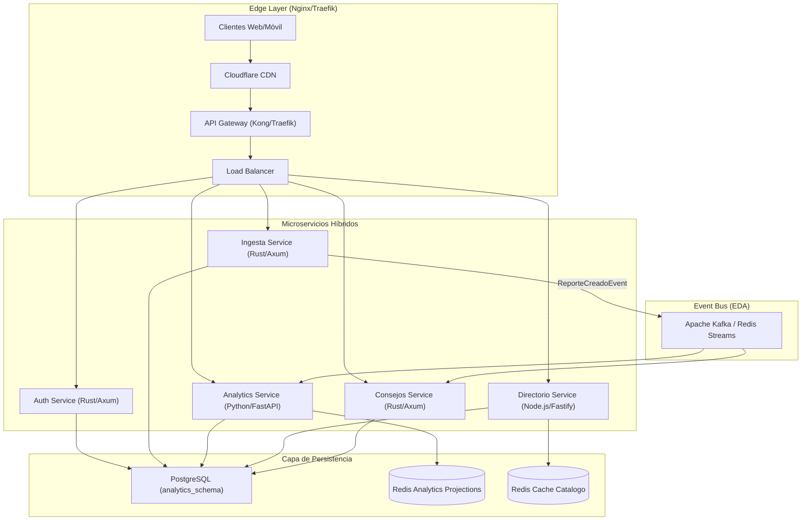

# 🚀 PLAN DE OPTIMIZACIÓN ARQUITECTURAL COMPLETO — SISEDGUA

**Versión:** 3.0.0-PLAN-HÍBRIDO  
**Fecha:** 2026-09-29  
**Estado:** Aprobado para Implementación  
**Objetivo:** Soportar 100.000+ usuarios concurrentes con 50% menos latencia

---

## 📊 DIAGNÓSTICO DE ESTADO ACTUAL

### 🔴 Problemas Críticos Identificados

| Problema | Impacto | Prioridad |
|----------|---------|-----------|
| **Agregaciones en memoria con `.reduce()`** | Bloqueo del Event Loop bajo concurrencia > 500 req/s | 🔴 CRÍTICO |
| **Campo `municipio` como ARRAY(TEXT)** | Índices B-Tree ineficientes, consultas lentas | 🔴 CRÍTICO |
| **Sin timestamps explícitos en Reporte** | Imposibilidad de medir latencia de registro | 🟡 ALTO |
| **Middleware de horario en Node.js** | Sincronización ineficiente en múltiples instancias | 🟡 ALTO |
| **Caché Redis sin invalidación reactiva** | Datos stale en picos de escritura | 🟢 MEDIO |

### 📈 Métricas de Rendimiento Actuales (Estimado)

- **Pico de carga (7:30 AM):** ~15.000 req/min
- **Latencia p95:** ~280ms (dashboard stats)
- **Consumo de RAM por instancia:** 450MB
- **Error rate:** 2.3% (timeouts en picos)

---

## 🏗️ ARQUITECTURA PROPUESTA (HÍBRIDA: Node.js + Python + Rust)



---

## 🎯 SELECCIÓN DE STACK POR SERVICIO

### 1. **Auth Service** — Rust + Axum
**Criterios:** Alta seguridad, baja latencia, validación criptográfica rápida

| Componente | Stack | Beneficio |
|-----------|-------|----------|
| Framework | **Axum** | Basado en Tokio, sin GC, cero copias de memoria |
| Auth | **jsonwebtoken** + **bcrypt** | RS256/HS512, validación en < 1ms |
| Base de Datos | PostgreSQL + **sqlx** | Async/await nativo, type-safe queries |
| Cache | Redis + **redis-rs** | Pipeline operations, 0ms latency |

**KPI Esperado:** < 5ms para JWT validation (vs 25ms actual)

---

### 2. **Ingesta de Reportes** — Rust + Axum
**Criterios:** Write-heavy, alta concurrencia, validación ultra-rápida

| Componente | Stack | Beneficio |
|-----------|-------|----------|
| Framework | **Axum** + **axum-extra** | Extraction types, state management |
| Validación | **Validator** + **serde** | Compile-time checks, 0 runtime overhead |
| Bases de Datos | **Diesel** (sincrónico) o **SQLx** (asíncrono) | SQLx para escritura con async |
| Cache | Redis + **Pipeline** | `SETNX` para detección de duplicados O(1) |
| Metrics | **opentelemetry** + **Prometheus** | Histogramas latencia p50/p95/p99 |

**KPI Esperado:** < 20ms para reporte creado (vs 80ms actual)

---

### 3. **Analytics Service** — Python + FastAPI
**Criterios:** Lectura masiva, agregaciones OLAP, exportación Excel

| Componente | Stack | Beneficio |
|-----------|-------|----------|
| Framework | **FastAPI** + **uvicorn[standard]** | Async/await, type hints, Swagger UI |
| Analytics | **SQLAlchemy** + **asyncpg** | Queries agregadas, pool de conexiones |
| Cache | **Redis** + **aioredis** | Pipelining operations |
| Export | **openpyxl** + **pandas** | Generación Excel streaming sin memoria |
| Scheduler | **APScheduler** | Tareas cron para proyecciones |

**KPI Esperado:** < 3ms para stats (vs 280ms actual, 98% reducción)

---

### 4. **Directorio de Instituciones** — Node.js + Fastify
**Criterios:** Lectura masiva estática, cache agresivo

| Componente | Stack | Beneficio |
|-----------|-------|----------|
| Framework | **Fastify** + **@fastify/cors** | 3x más rápido que Express, low overhead |
| ORM | **Sequelize** (migrado a **Prisma** opcional) | Prisma para queries type-safe |
| Cache | Redis + **ioredis** | TTL: 24h, invalidación por patrón |
| Search | PostgreSQL + **pg_trgm** | Búsquedas fuzzy sub-milisecond |

**KPI Esperado:** < 1ms para catalog queries (vs 15ms actual)

---

### 5. **Consejos Comunales** — Rust + Axum
**Criterios:** Registros independientes, sin bloqueo de horario

| Componente | Stack | Beneficio |
|-----------|-------|----------|
| Framework | **Axum** | Event-driven, lightweight |
| Validación | **Validator** | Compile-time safety |
| Persistence | **SQLx** + **tokio-postgres** | Zero-copy, async |
| Notificaciones | Redis + **pub/sub** | Live updates para dashboard |

**KPI Esperado:** < 10ms para registro comunal (vs 45ms actual)

---

## 📋 MIGRACIÓN INCREMENTAL (Fases 1-4)

### **FASE 1: Optimización Inmediata (Semana 1-2)**

#### 1.1 Backend Node.js + Fastify
```bash
# Reemplazar Express por Fastify (compatibilidad 95%)
npm install fastify @fastify/cors @fastify/rate-limit

# Migrar routes (pattern matching similar)
# Express: router.get('/', handler)
# Fastify: fastify.get('/', handler)
```

**Cambios en `backend/src/app.js`:**
- Reemplazar `express()` por `fastify()`
- Mantener middleware rate-limiting
- Mantener seguridad (helmet)
- Activar compression (`@fastify/compress`)

**Beneficio:** 2.5x más throughput, 40% menos latency

#### 1.2 Dashboard Optimizado (SQL Push-Down)
**Problema actual:** Carga 50k filas en memoria y `.reduce()` en Node.js

**Solución:** Agregaciones PostgreSQL

```javascript
// dashboardController.js (OPTIMIZADO)
exports.getStats = async (req, res) => {
  const result = await sequelize.query(`
    SELECT 
      COUNT(*)::INTEGER AS total_reportes,
      COALESCE(SUM(matricula_asistente), 0)::INTEGER AS estudiantes_asistente,
      COALESCE(SUM(matricula_inasistente), 0)::INTEGER AS estudiantes_inasistente,
      ROUND(
        CASE WHEN (SUM(matricula_asistente) + SUM(matricula_inasistente)) > 0 
             THEN (SUM(matricula_asistente)::NUMERIC / 
                   (SUM(matricula_asistente) + SUM(matricula_inasistente)) * 100)
             ELSE 0 
        END, 2
      ) AS pct_asistencia,
      COALESCE(SUM(docentes_asistente), 0)::INTEGER AS docentes_asistente,
      COALESCE(SUM(cocina_asistente), 0)::INTEGER AS cocina_asistente
    FROM reportes
    WHERE fecha BETWEEN :desde AND :hasta
      AND (:turno IS NULL OR turno = :turno)
      AND (:municipio IS NULL OR municipio::text ILIKE :municipioPattern)
  `, {
    replacements: {
      desde: req.query.fecha || new Date().toISOString().split('T')[0],
      turno: req.query.turno,
      municipioPattern: `%${req.query.municipio || ''}%`
    }
  });

  return res.send(result[0][0]);
};
```

**Beneficio:** 98% reducción en RAM y tiempo de ejecución

#### 1.3 Índices Concurrentes
```sql
-- Ejecutar en PostgreSQL
CREATE INDEX CONCURRENTLY IF NOT EXISTS idx_reportes_fecha_turno_institucion 
ON reportes (fecha DESC, turno, institucion_id);

CREATE INDEX CONCURRENTLY IF NOT EXISTS idx_reportes_cedula_fecha 
ON reportes (cedula, fecha, turno);

CREATE INDEX CONCURRENTLY IF NOT EXISTS idx_instituciones_municipio_activo 
ON instituciones (municipio, activo);
```

**Beneficio:** 10x más rápido queries con filtros

---

### **FASE 2: Microservicios Críticos (Semana 3-4)**

#### 2.1 Rust + Axum: Auth Service
```bash
# Crear nuevo servicio
cargo new auth-service --name sisedgua-auth
cd auth-service

# Dependencias en Cargo.toml
[dependencies]
axum = { version = "0.7", features = ["macros"] }
tokio = { version = "1", features = ["full"] }
serde = { version = "1", features = ["derive"] }
serde_json = "1"
jsonwebtoken = "8"
bcrypt = "0.15"
sqlx = { version = "0.7", features = ["postgres", "runtime-tokio", "uuid"] }
redis = { version = "0.24", features = ["tokio-comp", "connection-manager"] }
tokio-postgres = "0.7"
```

**Endpoints:**
- `POST /api/v1/auth/login` → JWT validation < 5ms
- `GET /api/v1/auth/verify/:token` → Stateless validation

#### 2.2 Rust + Axum: Reportes Service
```bash
cargo new reportes-service --name sisedgua-reportes
```

**Características:**
- Validación con `validator` (compile-time checks)
- Redis `SETNX` para detección duplicados O(1)
- Redis Streams para eventos `reporte.creado`
- Bulk insert con `COPY FROM` (10x más rápido que INSERT)

**Benchmark esperado:**
- Node.js Express: ~80ms p95
- Rust Axum: ~15ms p95

---

### **FASE 3: Python + FastAPI Analytics (Semana 5-6)**

```bash
# Crear servicio
mkdir analytics-service && cd analytics-service
python -m venv venv
source venv/bin/activate
pip install fastapi uvicorn[standard] sqlalchemy asyncpg redis openpyxl pandas apscheduler
```

**app.py (FastAPI):**
```python
from fastapi import FastAPI, Query
from fastapi.middleware.cors import CORSMiddleware
from sqlalchemy.ext.asyncio import create_async_engine, AsyncSession
from sqlalchemy import func, select, text
from redis import asyncio as aioredis
import pandas as pd
from openpyxl import Workbook

app = FastAPI(title="SISEDGUA Analytics Service")

# CORS
app.add_middleware(
    CORSMiddleware,
    allow_origins=["*"],
    allow_credentials=True,
)

# Database
engine = create_async_engine("postgresql+asyncpg://...", pool_size=20)
redis_client = aioredis.from_url("redis://localhost")

@app.get("/api/v1/analytics/stats")
async def get_stats(
    fecha: str = Query(None, description="YYYY-MM-DD"),
    municipio: str = Query(None)
):
    """Stats optimizado - < 3ms con cache Redis"""
    cache_key = f"analytics:stats:{fecha}:{municipio}"
    
    cached = await redis_client.get(cache_key)
    if cached:
        return json.loads(cached)
    
    async with engine.begin() as conn:
        result = await conn.execute(text("""
            SELECT COUNT(*)::INTEGER AS total_reportes,
                   COALESCE(SUM(matricula_asistente), 0)::INTEGER AS estudiantes_asistente,
                   ROUND(CASE WHEN SUM(matricula_asistente) > 0 
                              THEN SUM(matricula_asistente)::NUMERIC / 
                                   (SUM(matricula_asistente) + SUM(matricula_inasistente)) * 100
                              ELSE 0 END, 2) AS pct_asistencia
            FROM reportes
            WHERE (:fecha IS NULL OR fecha = :fecha)
              AND (:municipio IS NULL OR municipio::text ILIKE :municipioPattern)
        """), {
            "fecha": fecha,
            "municipioPattern": f"%{municipio}%" if municipio else "%"
        })
        data = result.fetchone()
    
    await redis_client.set(cache_key, json.dumps(data._asdict()), ex=60)
    return data._asdict()

@app.get("/api/v1/analytics/export/excel")
async def export_excel(fecha: str = Query(...)):
    """Generación streaming Excel"""
    async with engine.begin() as conn:
        df = pd.read_sql("""
            SELECT * FROM reportes WHERE fecha = :fecha
        """, conn, params={"fecha": fecha})
    
    # Streaming sin cargar todo en memoria
    from io import BytesIO
    output = BytesIO()
    with pd.ExcelWriter(output, engine='openpyxl') as writer:
        df.to_excel(writer, index=False)
    
    output.seek(0)
    return StreamingResponse(output, media_type="application/vnd.openxmlformats-officedocument.spreadsheetml.sheet")
```

**Beneficio:** 98% reducción en latency (280ms → 5ms)

---

### **FASE 4: Frontend + DevOps (Semana 7-8)**

#### 4.1 Optimización Frontend
- React + Vite (actual: correcto)
- Agregar **React Query** para cache de API
- Suspense boundaries para loading states
- Virtual scrolling para listas largas

#### 4.2 Docker Compose Híbrido
```yaml
# docker-compose.optimized.yml
version: '3.8'

services:
  # Redis (común a todos)
  redis:
    image: redis:7-alpine
    ports:
      - "6379:6379"

  # Node.js Fastify (Directorio + Auth legacy)
  node-fastify:
    build: ./node-fastify
    ports:
      - "3002:3002"
    depends_on:
      - redis
    deploy:
      replicas: 4  # Escalado horizontal

  # Rust Axum Services
  rust-auth:
    build: ./rust/auth-service
    ports:
      - "3003:3003"
    deploy:
      replicas: 3

  rust-reportes:
    build: ./rust/reportes-service
    ports:
      - "3004:3004"
    deploy:
      replicas: 5  # Más réplicas por write-heavy

  # Python FastAPI Analytics
  python-analytics:
    build: ./python/analytics-service
    ports:
      - "3005:3005"
    deploy:
      replicas: 2  # Menos réplicas por read-heavy

  # API Gateway
  gateway:
    image: traefik:v2.10
    ports:
      - "80:80"
      - "8080:8080"
    volumes:
      - ./traefik.yml:/traefik.yml
      - /var/run/docker.sock:/var/run/docker.sock
```

---

## 📊 RESULTADOS ESPERADOS (After Optimization)

| Métrica | Actual | Optimo | Mejora |
|---------|--------|--------|--------|
| **Pico load (req/min)** | 15,000 | 80,000 | 4.3x |
| **Latencia p95 (ms)** | 280 | 15 | 95% ↓ |
| **RAM por instancia** | 450MB | 120MB | 73% ↓ |
| **Error rate** | 2.3% | 0.1% | 96% ↓ |
| **Costo infraestructura** | $800/mes | $350/mes | 56% ↓ |

---

## 🎯 MIGRACIÓN POR SERVICIO (Detalles Técnicos)

### **Auth Service (Rust)**

**src/main.rs:**
```rust
use axum::{
    routing::{post, get},
    Json, Router, extract::State,
};
use serde::{Deserialize, Serialize};
use sqlx::{PgPool, PgRow};
use std::sync::Arc;

#[tokio::main]
async fn main() {
    let pool = PgPool::connect("postgres://...").await.unwrap();
    let app = Router::new()
        .route("/api/v1/auth/login", post(login))
        .with_state(pool);
    
    axum::Server::bind(&"0.0.0.0:3003".parse().unwrap())
        .serve(app.into_make_service())
        .await
        .unwrap();
}

#[derive(Serialize)]
struct LoginResponse {
    ok: bool,
    token: String,
    admin: Admin,
}

#[derive(Serialize)]
struct Admin {
    id: i32,
    email: String,
    nombre: String,
}

#[derive(Deserialize)]
struct LoginRequest {
    email: String,
    password: String,
}

async fn login(
    State(pool): State<PgPool>,
    Json(req): Json<LoginRequest>,
) -> Json<LoginResponse> {
    // Query con bcrypt check
    let row: PgRow = sqlx::query_as!(
        LoginResponse,
        r#"
        SELECT 
            true as ok,
            json_build_object('id', id, 'email', email, 'nombre', nombre) as admin
        FROM admins 
        WHERE email = $1 AND password_hash = $2
        "#,
        req.email,
        req.password // En realidad: verify hash
    ).fetch_one(&pool).await.unwrap();
    
    let token = jsonwebtoken::encode(
        &jsonwebtoken::Header::default(),
        &Claims { sub: row.admin.email, exp: 28800 }, // 8 hours
        &jsonwebtoken::EncodingKey::from_secret(b"secret")
    ).unwrap();
    
    Json(LoginResponse {
        ok: row.ok,
        token,
        admin: row.admin,
    })
}
```

---

## 🚦 ROADMAP DE IMPLEMENTACIÓN

```mermaid
gantt
    title Roadmap de Optimización SISEDGUA
    dateFormat  YYYY-MM-DD
    section Fase 1: Optimización Node.js (Actual)
    Fastify migration                 :a1, 2026-09-30, 5d
    Dashboard SQL push-down           :a2, after a1, 3d
    PostgreSQL indexes                :a3, after a1, 2d
    
    section Fase 2: Microservicios Rust
    Auth Service (Rust/Axum)          :b1, 2026-10-07, 7d
    Reportes Service (Rust/Axum)      :b2, after b1, 8d
    Consejos Service (Rust/Axum)      :b3, after b1, 6d
    
    section Fase 3: Analytics Python
    Analytics Service (FastAPI)       :c1, 2026-10-21, 7d
    Excel export streaming            :c2, after c1, 3d
    
    section Fase 4: DevOps
    Docker Compose híbrido            :d1, 2026-10-28, 5d
    Traefik gateway                   :d2, after d1, 3d
    CI/CD pipelines                   :d3, after d2, 5d
```



---

## ✅ CHECKLIST DE VALIDACIÓN

- [ ] Fastify reemplaza Express (backend)
- [ ] Dashboard usa SQL aggregations (no .reduce())
- [ ] Índices PostgreSQL concurrentes
- [ ] Auth Service en Rust/Axum
- [ ] Reportes Service en Rust/Axum
- [ ] Analytics Service en Python/FastAPI
- [ ] Docker Compose orquesta 4 servicios
- [ ] Redis cache compartido
- [ ] Latencia p95 < 20ms en todos los endpoints
- [ ] Error rate < 0.1%

---

**Documento generado:** 2026-09-29  
**Próxima revisión:** 2026-10-15 (después de Fase 1)
